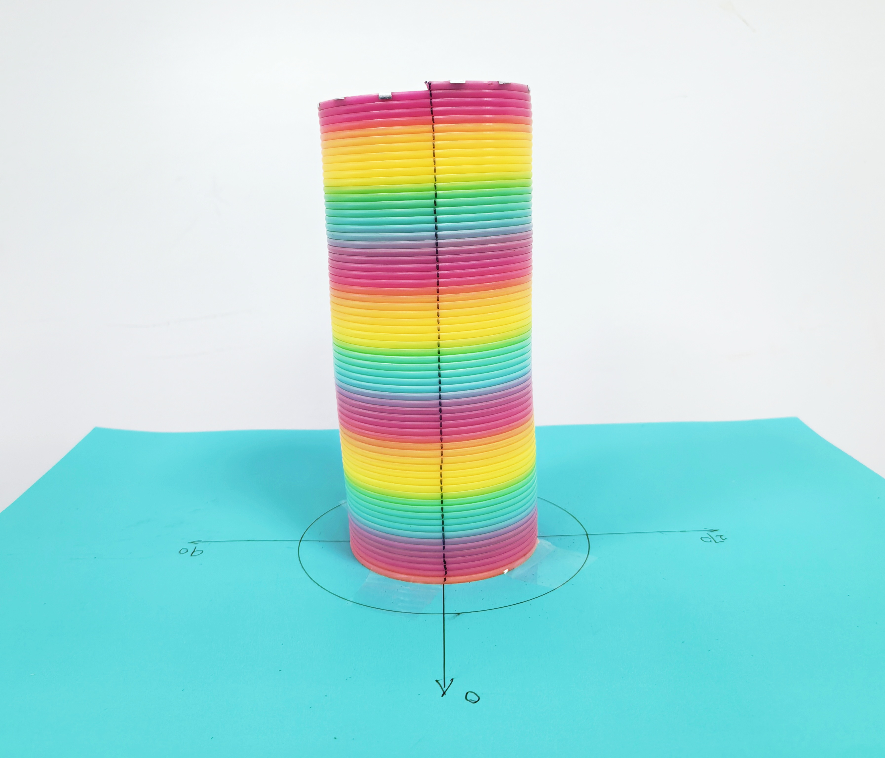
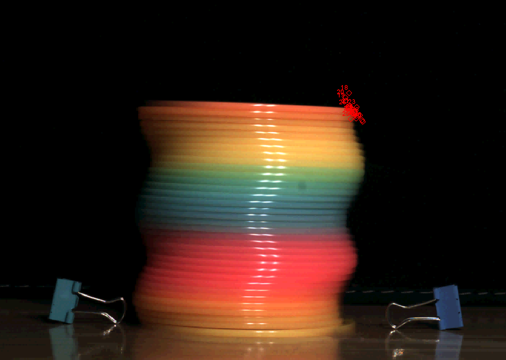

# Twisted Slinky Waves

This repository contains research and teaching materials for studying the wave dynamics of a twisted slinky. The project investigates the coupled motion that arises when a slinky is twisted and released while its bottom end is fixed.

In this configuration, a torsional disturbance propagates along the slinky and reflects at the boundaries, producing a characteristic periodic motion. At the same time, the rotation of the coils generates transverse motion through centripetal acceleration, resulting in coupled torsional and transverse dynamics that can be directly observed in experiments.

The phenomenon provides a simple and visually clear demonstration of wave propagation, boundary conditions, and coupled motion in mechanical systems.

This repository is intended to support both **research reproducibility** and **educational use**.

Author information will be added after publication.

---

# Physical system

The experiments use a commercial **plastic slinky toy**. Plastic slinkies are recommended because they reproduce the observed dynamics more reliably than steel springs.

In preliminary tests with steel springs, two difficulties were observed:

- For large initial twists, the transverse motion becomes large and the spring tends to collapse.
- For small twists, the transverse oscillation is weak and difficult to observe.

From a physical perspective, this behavior is related to the material parameters of the spring. Steel springs typically have smaller effective elastic moduli relative to their density, which reduces the shear forces responsible for providing the centripetal acceleration required for stable rotational motion of the coils. As a result, the transverse displacement can grow rapidly.

This effect can also be explored numerically by modifying the material parameters in the MATLAB simulation.

---

# Repository structure

The repository is organized as follows:

twisted-slinky-waves

code/
MATLAB scripts for theoretical modeling and numerical simulations.

data/
Experimental data extracted from video analysis.

videos/
Example recordings of the twisted slinky experiment, including demonstrations of torsional and transverse motion. The example videos included in this repository were recorded using **Spring No.2** listed in the parameter table of the paper. Other springs with different parameters were also tested in the experiments, but Spring No.2 is used here as a representative example.

tracker/
Tracker project files used for motion tracking and data extraction.

teaching/
Notes and suggested activities for classroom demonstrations and student projects.

README.md

---

# Experimental setup

The experiment uses a plastic slinky whose bottom end is fixed to a horizontal surface. The top of the slinky is twisted several turns and then released.

The motion is recorded using a high-speed camera (WP-GUT130) at **300 fps**. A reflective marker is attached to the top coil to facilitate motion tracking.

The recorded videos are analyzed using **Tracker (version 6.3.x)** to obtain time series data of the motion.

The experimental data provided in this repository are stored in:

data/experiment data.xlsx

---

# Data analysis

The motion of selected points on the slinky is extracted using Tracker. The resulting position and velocity data are used to determine the oscillation periods of the observed waves.

For the transverse motion, the oscillation frequency can also be estimated using a **fast Fourier transform (FFT)** of the velocity signal.

---

# Numerical modeling

The `code/` directory contains MATLAB scripts used to model the dynamics of the system.

### torsional_wave_model.m

Solves the torsional wave equation and visualizes the angular motion of the slinky. The script generates:

- angular displacement as a function of position and time
- angular velocity distributions
- three-dimensional visualizations of the wave evolution

### transverse_wave_simulation.m

Solves the equation governing the transverse motion of the coil centers. The script produces:

- two-dimensional trajectories of the top coil
- displacement–time curves
- velocity–time curves
- oscillation period estimates using FFT

The simulations were developed and tested using **MATLAB R2024a**.

---

# Teaching resources

The system can be used as a classroom demonstration or as part of an undergraduate laboratory experiment on wave motion.

Possible student activities include:

- measuring the period of the torsional wave
- verifying that the torsional wave period is independent of the initial twist
- investigating how the transverse motion depends on the initial twist
- comparing experimental observations with numerical simulations

Additional teaching notes and suggested exercises may be included in the `teaching/` directory.

---

# Reproducibility

All experimental videos, data files, and simulation codes required to reproduce the main results are included in this repository.

The materials are intended to allow instructors and students to reproduce the experiment, perform motion analysis using Tracker, and compare the observations with numerical simulations.

---

# License

This repository is released under the MIT License.
