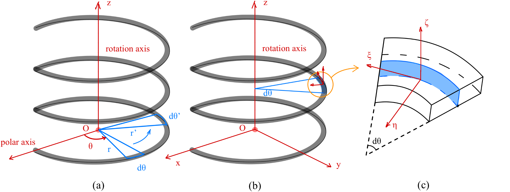
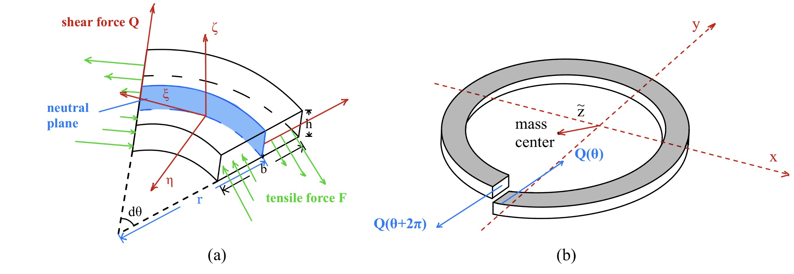
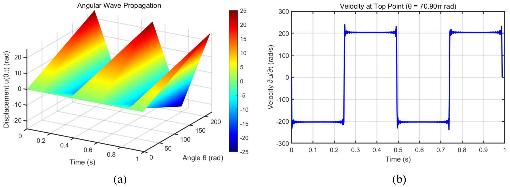

# Experimental Principles of the Twisted Slinky Experiment

## 1. Introduction

In this experiment, the bottom of a slinky is fixed, the top is twisted through several turns, and then released. Two kinds of motion are observed:

- a **torsional wave**, in which the coils rotate about the slinky axis and the torsional disturbance propagates along the slinky;
- a **transverse wave**, observed from the side as the propagation of lateral motion of the coil centers.

The theoretical description used in this project does not attempt to solve the full three-dimensional coupled dynamics of the slinky. Instead, it adopts a layered approach:

1. first describe the torsional motion as the dominant part of the dynamics;
2. then use the resulting torsional motion as a known input to construct a simplified model for the transverse response.

This treatment captures the main physical mechanisms while remaining suitable for teaching, interpretation, and numerical computation.

---

## 2. Geometric description and basic assumptions

To describe the propagation of the torsional disturbance, we introduce a cylindrical coordinate system with the center of the bottom coil as the origin and the vertical direction as the $z$-axis.

Unlike the usual cylindrical coordinate, the angular coordinate $\theta$ is taken to be **non-periodic**: each full turn increases $\theta$ by $2\pi$. In this way, $\theta$ serves not only as an angle, but also as a spatial coordinate along the slinky.

For a tightly packed slinky, the pitch is approximately equal to the coil thickness $h$, so the vertical coordinate is related to $\theta$ by

$$
z = \frac{h}{2\pi}\theta .
$$

In addition, within the range of motion considered here, the axial stretching of the slinky material is relatively small. The arc length of the neutral line is therefore approximated as unchanged:

$$
ds = r d\theta = r' d\theta' ,
$$

where the primed quantities denote the deformed configuration.

For the local force analysis, we also introduce a coordinate system attached to a small coil element:

- the $\xi$-axis is tangent to the neutral line;
- the $\eta$-axis points toward the slinky axis;
- the $\zeta$-axis is parallel to the slinky axis.

In what follows:

- $u(\theta,t)$ denotes the angular displacement;
- $v(\theta,t)$ denotes a small local displacement along the $\eta$-direction.

It is important to note that $v(\theta,t)$ is an intermediate variable used to describe local shear deformation. The experimentally observed **transverse wave** is the lateral motion of the coil centers in the horizontal plane, which is reconstructed later from the force distribution.

---

## 3. Torsional wave: the dominant rotational dynamics

### 3.1 Angular displacement

Following the discussion of the observed dynamics, the dominant motion after release is the rotation of the coils about the slinky axis. When the lateral motion is relatively small and the rotation axis is approximately fixed, this motion can be treated as a single-degree-of-freedom problem depending only on $\theta$.

We define the angular displacement by

$$
u(\theta,t) = \theta'(\theta,t) - \theta ,
$$

where $\theta'$ is the actual angular coordinate after release.

---

### 3.2 Restoring torque

To derive the equation of motion, consider a small coil element in the local coordinate system.

A material point at coordinate $\eta$ in the cross section has original arc length $(r-\eta)d\theta$ and deformed arc length $(r'-\eta)d\theta'$. Since the neutral line approximately preserves its arc length,

$$
ds = r d\theta = r' d\theta' ,
$$

the linear extension of that material point is

$$
\Delta l = (r' - \eta)d\theta' - (r - \eta)d\theta .
$$

Using $u = \theta' - \theta$ and keeping only first-order terms, one obtains

$$
\Delta l \approx -\eta \frac{\partial u}{\partial \theta} d\theta .
$$

This shows that the extension is proportional to the distance $\eta$ from the neutral layer and changes sign across it. The normal stress is therefore linearly distributed across the section: one side is in tension and the other side is in compression.

For a symmetric rectangular cross section, the resultant force is approximately zero, but the stress distribution produces a **couple**, and hence a restoring torque. Because it is a couple, its magnitude does not depend on the particular choice of rotation axis.

The restoring torque is

$$
M = \frac{E b h^3}{12 r}\frac{\partial u}{\partial \theta} ,
$$

where

- $E$ is the elastic modulus,
- $b$ is the width of the rectangular cross section,
- $h$ is the thickness of the rectangular cross section.

In the cylindrical description, the shear force is parallel to the cross section. Under the Bernoulli-beam approximation, it does not contribute a torque about the slinky axis. Therefore, neglecting friction and other secondary effects, the restoring torque above can be taken as the total torque acting on the element.

---

### 3.3 Equation of motion for the torsional wave

Consider a small coil element of angular width $d\theta$. Let $r_1$ and $r_2$ be the inner and outer radii of the rectangular cross section. The moment of inertia of this element about the slinky axis is

$$
I = \frac{1}{4}\rho h \left( r_2^4 - r_1^4 \right) d\theta ,
$$

where $\rho$ is the material density.

Applying rotational dynamics to the element gives

$$
M(\theta + d\theta, t) - M(\theta, t) =
I \frac{\partial^2 u}{\partial t^2} .
$$

Substituting the expression for $M$ and taking the continuous limit $d\theta \to 0$, we obtain the wave equation for the torsional motion:

$$
\frac{\partial^2 u}{\partial t^2} - \omega_v^2 \frac{\partial^2 u}{\partial \theta^2} =
0 ,
$$

with

$$
\omega_v =
\frac{r_2 - r_1}{r_2 + r_1}
\sqrt{\frac{2E}{3\rho (r_1^2 + r_2^2)}} .
$$

This equation shows that the angular disturbance propagates along the slinky, and that the characteristic propagation speed is determined by both material properties and cross-sectional geometry.

---

### 3.4 Boundary and initial conditions

To solve the torsional-wave equation, two boundary conditions and two initial conditions are required.

- The bottom end is fixed, so the angular displacement there is zero.
- The top end is approximately free, so the restoring torque there is zero. Since $M \propto \partial u / \partial \theta$, this gives a zero-gradient condition at the top.
- The slinky is released from rest, so the initial angular velocity is zero everywhere.
- Before release, the slinky is in static equilibrium under the applied twist. The torque is then approximately uniform along the slinky, which implies that $\partial u / \partial \theta$ is approximately constant. Therefore, the initial angular displacement is approximately linear in $\theta$.

The boundary and initial conditions are thus

$$
u(0,t) = 0 ,
$$

$$
u_{\theta}(\theta_0,t) = 0 ,
$$

$$
u_t(\theta,0) = 0 ,
$$

$$
u(\theta,0) = u_0 \frac{\theta}{\theta_0} ,
$$

where

- $\theta_0$ is the angular coordinate of the top in the natural state,
- $u_0$ is the initial angular displacement at the top.

---

### 3.5 Solution and main predictions

Using separation of variables, the solution is

$$
u(\theta,t) =
\sum_{n=0}^{\infty}
A_n \sin(k_n \theta)\cos(k_n \omega_v t) ,
$$

where

$$
A_n = (-1)^n \frac{8u_0}{(2n+1)^2 \pi^2} ,
\qquad
k_n = \frac{(2n+1)\pi}{2\theta_0} .
$$

Only odd modes appear, which is consistent with the fixed-bottom and free-top boundary conditions.

Since all modal frequencies are odd multiples of the fundamental frequency, the overall motion has a common period. The principal period is determined by the fundamental mode:

$$
T =
4\theta_0
\frac{r_2 + r_1}{r_2 - r_1}
\sqrt{\frac{3\rho (r_1^2 + r_2^2)}{2E}} .
$$

The angular velocity of the **top point** is obtained by differentiating the solution with respect to time and setting $\theta = \theta_0$:

$$
u_t(\theta_0,t) = - \sum_{n=0}^{\infty}
A_n
\frac{(2n+1)\pi}{2\theta_0}
\omega_v
\sin\left(
\frac{(2n+1)\pi}{2\theta_0}\omega_v t
\right) .
$$

Because this is a superposition dominated by odd harmonics, the angular velocity of the top point is approximately **square-wave-like** in time, while the corresponding angular displacement is approximately **sawtooth-like**.

---

### 3.6 Radius variation induced by the torsional motion

The torsional-wave solution also implies a time-dependent change in the coil radius.

From the length constraint

$$
ds = r d\theta = r' d\theta' ,
$$

we obtain

$$
r'(\theta,t) = r \frac{d\theta}{d\theta'} =
\frac{r}{1 + \dfrac{\partial u}{\partial \theta}} .
$$

Substituting the analytical solution for $u$,

$$
r'(\theta,t) =
\frac{r}{
1 +
\sum_{n=0}^{\infty}
A_n k_n \cos(k_n \theta)\cos(k_n \omega_v t)
} .
$$

This radius variation will be used in the simplified model for the transverse response.

---

## 4. Transverse response: from local shear to coil-center motion

### 4.1 Basic idea

The experimentally observed **transverse wave** is the lateral motion of the coil centers in the horizontal plane. In the theoretical model, this motion is not introduced directly. Instead, the treatment proceeds in three steps:

1. analyze the local response of a small coil element and introduce the intermediate variable $v(\theta,t)$;
2. obtain the shear-force distribution $Q(\theta,t)$ from $v(\theta,t)$;
3. apply Newton’s second law to a single coil to determine the motion of its center in the horizontal plane.

This layered treatment avoids the complexity of solving the full three-dimensional coupled problem while retaining the main mechanical chain of the transverse response.

---

### 4.2 Local shear deformation and shear force

Experiments show that the transverse response always develops together with the torsional motion. Therefore, the torsional-wave solution $u(\theta,t)$ obtained above is taken as a known input.

The effect of the torsional motion on the local transverse dynamics is represented by a position- and time-dependent centripetal acceleration term. To describe the local response, introduce $v(\theta,t)$, the small displacement of the slinky element along the local $\eta$-direction.

For small deformations, the local shear angle is

$$
\gamma_s = \frac{1}{r}\frac{\partial v}{\partial \theta} .
$$

According to the Timoshenko-beam description, the shear force is

$$
Q = \kappa G A \frac{1}{r}\frac{\partial v}{\partial \theta} ,
$$

where

- $A = hb$ is the cross-sectional area,
- $G$ is the shear modulus,
- $\kappa$ is the shear correction factor.

For a rectangular cross section, the model uses

$$
\kappa = \frac{5}{6} .
$$

In this approximation, the local transverse dynamics is dominated by the shear force. For a symmetric rectangular cross section and small deformation, the normal stress mainly produces a self-balanced distribution inside the section, and its net contribution to the transverse translation of the coil is treated as a higher-order correction. Therefore, only the shear force is retained in the model.

---

### 4.3 Forced equation for the intermediate variable $v(\theta,t)$

Consider a small coil element of length $r d\theta$. Its mass is

$$
\rho A r d\theta .
$$

Along the local $\eta$-direction, the acceleration has two parts:

- the translational acceleration associated with $v$, namely $\partial^2 v / \partial t^2$;
- the centripetal acceleration associated with the torsional motion, namely $(\partial u / \partial t)^2 r'$, where $r'(\theta,t)$ is given by the torsional-wave solution.

The force balance along the $\eta$-direction is therefore

$$
Q(\theta + d\theta,t) - Q(\theta,t) = \rho A r d\theta
\left(
\frac{\partial^2 v}{\partial t^2} - \left( \frac{\partial u}{\partial t} \right)^2 r'
\right) .
$$

Substituting the expression for $Q$ and taking the continuous limit gives the forced wave equation

$$
\frac{\partial^2 v}{\partial t^2} - \frac{\kappa G}{\rho r^2} \frac{\partial^2 v}{\partial \theta^2} = \left( \frac{\partial u}{\partial t} \right)^2 r' .
$$

This is **not** yet the equation for the experimentally observed transverse wave. Rather, it is the equation for the intermediate variable $v(\theta,t)$, which describes the local shear-related response of the slinky.

The boundary and initial conditions are taken as

$$
v(0,t) = 0 ,
$$

$$
v_{\theta}(\theta_0,t) = 0 ,
$$

$$
v(\theta,0) = 0 ,
$$

$$
v_t(\theta,0) = 0 .
$$

These express, respectively:

- zero local displacement at the fixed bottom end,
- zero shear at the approximately free top end,
- zero initial local transverse displacement,
- zero initial local transverse velocity.

---

### 4.4 Motion of a single coil center

After $v(\theta,t)$ is obtained, the shear-force distribution $Q(\theta,t)$ can be calculated. The next step is to determine the actual lateral motion of a single coil center in the horizontal plane.

Let the lower and upper ends of a coil correspond to angular coordinates $\theta$ and $\theta + 2\pi$, respectively. Define the complex displacement

$$
\tilde{z} = x + iy ,
$$

which represents the motion of the coil center in two orthogonal horizontal directions.

The resultant force on the coil is approximated by the vector difference of the shear forces at its two ends:

$$
Q(\theta)e^{i\theta'} - Q(\theta+2\pi)e^{i(\theta+2\pi)'} = \gamma \frac{d\tilde{z}}{dt} + \rho A 2\pi r \frac{d^2 \tilde{z}}{dt^2} ,
$$

where

- $\theta' = \theta + u(\theta,t)$,
- $\gamma$ is a phenomenological damping coefficient introduced to describe dissipation and prevent unbounded motion.

The solution $\tilde{z}(t)$ obtained from this equation corresponds to the experimentally observed lateral motion of the coil center, that is, to the **transverse wave**.

---

## 5. Summary of the modeling strategy

The theoretical treatment used in this experiment can be summarized as follows:

1. **Torsional wave**
   - define the angular displacement $u(\theta,t)$;
   - derive the restoring torque from the stress distribution in the cross section;
   - obtain the torsional-wave equation and solve it analytically;
   - predict the period and the square-wave-like angular velocity of the top point.

2. **Transverse response**
   - treat the torsional-wave solution as a known input;
   - introduce $v(\theta,t)$ to describe the local shear-related response;
   - compute the shear-force distribution $Q(\theta,t)$;
   - use the force difference on a single coil to obtain the motion of its center in the horizontal plane.

This approach does not attempt to reproduce every detail of the real motion. Its purpose is to capture the main time scales, the dominant wave features, and the physical relation between the torsional wave and the transverse wave.

---

## 6. Scope and limitations of the model

The model is intentionally simplified for clarity and teaching value.

### Torsional-wave model
The torsional-wave model assumes:

- an approximately fixed rotation axis;
- weak coupling to lateral motion;
- a Bernoulli-type approximation for the rotational dynamics.

It captures the main propagation behavior and predicts the period accurately.

### Transverse-response model
The transverse-response model assumes:

- the torsional wave acts as a known driver;
- the main local restoring effect is shear;
- higher-order geometric nonlinearities are neglected;
- the net contribution of normal stress to the coil-center translation is neglected;
- dissipation is represented only phenomenologically.

For this reason, the transverse model is better suited to describing the **main period and overall trend** than to reproducing every detail of the waveform or trajectory.

---

## 7. Connection to experiment

This theoretical framework leads to several predictions that can be checked experimentally:

- the period of the torsional wave is approximately independent of the initial twist angle;
- the angular velocity of the top point is approximately square-wave-like in time;
- the transverse response develops together with the torsional motion;
- the characteristic period of the transverse wave depends on the initial twist angle.

These points provide the basis for the experimental measurements described in the teaching notes and in the main paper.
